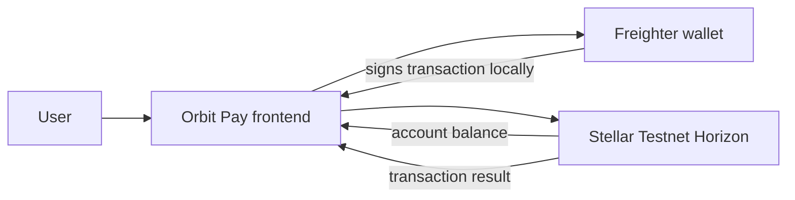

# Orbit Pay · Stellar White Belt

Orbit Pay is a simple, user-facing XLM payment dApp built on Stellar Testnet. It demonstrates the complete White Belt flow: connect Freighter, read an account's XLM balance, sign an XLM payment, submit it to Testnet, and show the confirmed transaction to the user.

- **Public repository:** [github.com/Hexdee/orbit-pay](https://github.com/Hexdee/orbit-pay)
- **Live demo:** [orbit-pay-dusky.vercel.app](https://orbit-pay-dusky.vercel.app)

## White Belt requirements

- Freighter wallet connection on Stellar Testnet
- In-app wallet disconnect/reset
- Connected wallet address display
- Live XLM balance from Horizon Testnet
- XLM payment form with recipient and amount validation
- Freighter transaction signing
- Confirmed Testnet transaction hash and Stellar Expert link
- Success, failure, loading, unfunded-wallet, and wallet-not-detected states
- Responsive mobile UI
- Automated formatting tests and a CI workflow

## Run locally

Requirements: Node.js 20+ and pnpm 10+.

```sh
pnpm install
pnpm test
pnpm dev
```

Open the local URL shown by Vite. Install [Freighter](https://www.freighter.app/), switch it to **Stellar Testnet**, and fund the selected account with [Friendbot](https://friendbot.stellar.org/). Orbit Pay uses the public Testnet Horizon endpoint; no secret keys or environment variables are needed.

To verify a production build:

```sh
pnpm build
pnpm preview
```

## Testnet demo flow

1. Open Orbit Pay in a browser with Freighter installed.
2. Switch Freighter to Stellar Testnet.
3. Fund the account through Friendbot if its balance is empty.
4. Click **Connect Freighter**.
5. Confirm the shortened address and XLM balance appear.
6. Enter another funded Testnet account and a small XLM amount.
7. Click **Send XLM** and approve the transaction in Freighter.
8. Confirm the success panel and open the Stellar Expert transaction link.
9. Capture the required screenshots listed below.

## Screenshots for submission

The submission evidence is included in `docs/submission/assets/`:

| File | Evidence |
| --- | --- |
| [`orbit-pay-wallet-connected.png`](docs/submission/assets/orbit-pay-wallet-connected.png) | Freighter disconnected/connected UI with the Testnet balance visible |
| [`orbit-pay-successful-transaction.png`](docs/submission/assets/orbit-pay-successful-transaction.png) | Connected wallet, balance, success state, and transaction link |
| [`orbit-pay-initial-state.png`](docs/submission/assets/orbit-pay-initial-state.png) | Initial Testnet-only wallet state |

The screenshots should show the deployed URL or local app in the browser, with wallet addresses and transaction data visible but no secret phrases or private keys.

## Testnet transaction evidence

The successful payment is visible in `orbit-pay-successful-transaction.png`. The full transaction hash still needs to be added here after confirming the 64-character value from Stellar Expert; the hash supplied for this submission was one character short for a valid Stellar transaction ID.

## Architecture



Orbit Pay is non-custodial: the frontend constructs a native XLM payment, Freighter signs it, and Horizon submits it to Stellar Testnet. The app never receives or stores a secret key.

## Tests

```sh
pnpm test
```

The test suite covers address shortening, XLM formatting, and user-facing error preservation. The GitHub Actions workflow runs the tests and production build on every push and pull request.

## Network and safety

This is a Testnet-only educational dApp. XLM on Stellar Testnet has no real-world value. Verify the network in Freighter before signing, and never paste a seed phrase or secret key into any website.

## Repository and deployment

The project is published at [github.com/Hexdee/orbit-pay](https://github.com/Hexdee/orbit-pay) and deployed at [orbit-pay-dusky.vercel.app](https://orbit-pay-dusky.vercel.app). The deployment uses these Vite settings:

- Install command: `pnpm install --frozen-lockfile`
- Build command: `pnpm build`
- Output directory: `dist`

The final submission should include the public repository URL, live demo URL, this README, the three screenshots, and the Testnet transaction link from the successful demo.
