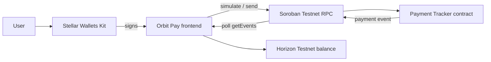

# Orbit Pay · Stellar Yellow Belt

Orbit Pay is a multi-wallet Stellar Testnet dApp that records payment receipts on Soroban and synchronizes them into a real-time activity feed. It extends the original White Belt payment experience with Stellar Wallets Kit, a deployed contract, contract reads/writes, transaction states, and event polling.

- **Public repository:** [github.com/Hexdee/orbit-pay](https://github.com/Hexdee/orbit-pay)
- **Live demo:** [orbit-pay-dusky.vercel.app](https://orbit-pay-dusky.vercel.app)
- **Network:** Stellar Testnet

## Yellow Belt requirements

- Stellar Wallets Kit multi-wallet picker
- Freighter, xBull, Lobstr, Albedo, Rabet, WalletConnect, and other supported options through the kit
- Wallet disconnect and switch-wallet flow
- Soroban Payment Tracker contract deployed to Testnet
- Frontend contract call: `record_payment`
- Frontend contract read/event synchronization
- Pending, success, rejected, unavailable-wallet, unfunded-wallet, and insufficient/invalid-input states
- Testnet contract deployment workflow
- Three Soroban unit tests and three frontend utility tests
- Responsive frontend and CI verification

## Deployed contract

| Item | Value |
| --- | --- |
| Contract | [`CC3ZNNYZ5F74AVXQEHUI655TIM37AQE5Z3PBUHD3WPCSRHP4G2FYQ5BA`](https://stellar.expert/explorer/testnet/contract/CC3ZNNYZ5F74AVXQEHUI655TIM37AQE5Z3PBUHD3WPCSRHP4G2FYQ5BA) |
| Deploy transaction | [`45b1f6c2dac199b8fd3e495abc8ef9b162e3f14e0deaa2c0ff1c747b22e0a2c9`](https://stellar.expert/explorer/testnet/tx/45b1f6c2dac199b8fd3e495abc8ef9b162e3f14e0deaa2c0ff1c747b22e0a2c9) |
| Initialize transaction | [`ddb6eb5f91f1542ff309ee3bdeec22c774461fa91f79dd1e72069b2f6acceade`](https://stellar.expert/explorer/testnet/tx/ddb6eb5f91f1542ff309ee3bdeec22c774461fa91f79dd1e72069b2f6acceade) |
| WASM hash | `27c6ef5d99235348b1451a38e2843c542ab775ee2a88a663239519ce205bd367` |

## How to use the live app

1. Open the [live demo](https://orbit-pay-dusky.vercel.app).
2. Click **Choose wallet** and select a supported Stellar wallet.
3. Switch the wallet to Stellar Testnet and fund it with [Friendbot](https://friendbot.stellar.org/) if necessary.
4. Enter a valid recipient address, an XLM amount, and a payment note.
5. Click **Record payment** and approve the Soroban contract call.
6. Watch the pending/success state and open the Stellar Expert transaction link.
7. The new receipt appears in the real-time payment activity feed.

This records a payment receipt on-chain; it does not custody funds or pretend to transfer XLM. The contract records the payer, recipient, amount, note, and ledger, then emits a `payment` event.

## Run locally

Requirements: Node.js 20+, pnpm 10+, Rust, and the Stellar CLI.

```sh
pnpm install
pnpm test
pnpm build
pnpm dev
```

The frontend uses the deployed Testnet contract by default. To point it at another deployment, copy `.env.example` to `.env` and set `VITE_PAYMENT_TRACKER_CONTRACT_ID`.

## Contract workflow

Run the Soroban contract tests:

```sh
pnpm contract:test
```

Build the WASM:

```sh
pnpm contract:build
```

Deploy a fresh Testnet instance with the configured local `alice` Stellar identity:

```sh
pnpm contract:deploy
```

The deployment script uploads the WASM, creates the contract, initializes it, and writes the contract address, deployment transaction, initialization transaction, and WASM hash to `deployments.testnet.json`. Never commit a secret key or seed phrase.

## Architecture



The `PaymentTracker` contract exposes:

- `initialize()`
- `record_payment(payer, recipient, amount, memo)`
- `get_total()`
- `get_payment(id)`

The frontend polls Soroban RPC every eight seconds, requests the latest ledger, filters the deployed contract’s events, and renders the newest payment receipts with transaction links.

## Error handling

Orbit Pay explicitly handles:

1. **Wallet unavailable:** the user is told to choose another supported wallet.
2. **Wallet rejection:** the user is told the request was rejected and can retry.
3. **Unfunded account:** the UI points the user to Friendbot for Testnet funding.

It also validates recipient addresses and positive amounts, shows simulation and submission progress, and displays failed contract-call details.

## Tests and CI

```sh
pnpm test
pnpm contract:test
pnpm build
```

GitHub Actions runs the frontend tests, production build, Rust formatting, contract tests, and contract build on pushes and pull requests.

## Yellow Belt submission evidence

- [Contract deployment output](deployments.testnet.json)
- [Contract address on Stellar Expert](https://stellar.expert/explorer/testnet/contract/CC3ZNNYZ5F74AVXQEHUI655TIM37AQE5Z3PBUHD3WPCSRHP4G2FYQ5BA)
- [Wallet options screenshot](docs/submission/assets/yellowbelt-wallet-options.png)
- [Contract success screenshot](docs/submission/assets/yellowbelt-contract-success.png)
- [Live event feed screenshot](docs/submission/assets/yellowbelt-live-events.png)

This project is Testnet-only for educational use. Testnet XLM has no real-world value. Never enter a seed phrase or secret key into any website.
